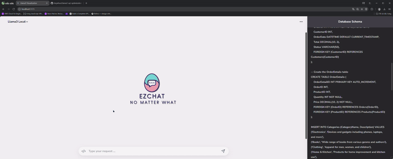

# SQL Optimization with Llama3
---

**The project is built on the idea of optimizing SQL query statements. Its goal is to enhance query optimization by leveraging large language models (LLMs). The primary model applied in the project is Llama3, integrated with several techniques to support visual query analysis. Through various extensions, the project aims to directly execute SQL statements and visualize them using different types of charts.**


<div align="center">
  
</div>


# Built with:
    Flask
    Groq Cloud
    Langchain Communitity
    Llama3 8b (local)
    Llama3 70b (groq)

# Installation:

```bash
# Clone dự án từ GitHub
git clone https://github.com/keysKuo/Llama3-sql-optimization.git

# Đi vào thư mục của dự án
cd Llama3-sql-optimization/

# Cài đặt các package từ tệp requirements.txt
pip install -r requirements.txt

# Đi vào thư mục frontend
cd frontend/

# Cài đặt các package frontend
npm install
```

# Environment:
Setup ``.env`` according to ``.env.example`` 

```sh
DB_USER=<username>
DB_PASSWORD=<password>
DB_NAME_SETUP=sys # Initial database
DB_NAME_USE=<databasename> # Using database

OPENAI_API_BASE=https://api.groq.com/openai/v1
OPENAI_MODEL_NAME=llama3-70b-8192
OPENAI_API_KEY=groqapikey # Groq cloud API Key
```

# Run app:

```bash
# Run Backend from root directory
python crewai/index.py 
# Default http://localhost:5000

# Run Frontend from frontend directory
cd frontend/
npm run dev 
# Default http://localhost:5173
```

