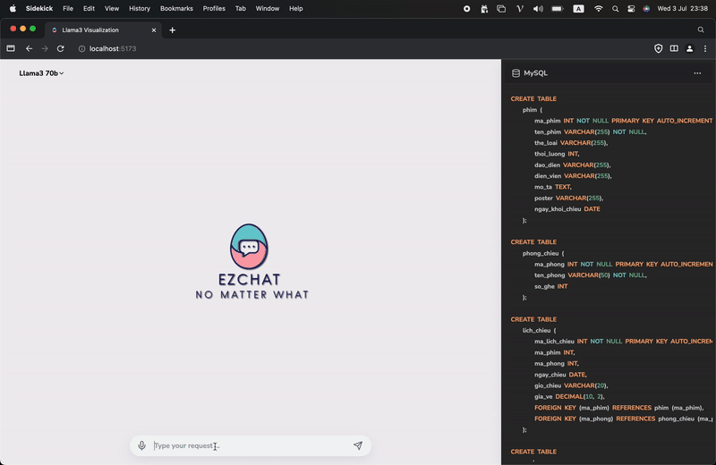

<div align="center">
  <a href="https://postwoman.io">
  </a>
  <br/>
  <br/>

  [](https://github.com/keysKuo/Llama3-sql-optimization.git) [](https://ezticket.io.vn) [](https://discord.gg/Z4ZxSRF6) [](https://pypi.python.org/pypi/ansicolortags/)


 [![React][React.js]][React-url][![TailwindCSS][TailwindCSS]][TailwindCSS-url]
 ![MySQL][MySQL]
 ![MongoDB][MongoDB]

  </p>
  <p>
    <sub>Built with ✏️ by
      <a href="https://github.com/keysKuo">nkeysKuo</a> and
      <a href="https://github.com/keysKuo">NewAI teams</a>
    </sub>
  </p>
</div>

# SQL Learning Support System with Large Language Models


The SQL Learning Support System with Large Language Models is designed to improve how individuals learn and work with SQL. By using advanced language models like Llama3, Gemma2, Mistral,... this system provides smart and helpful support for understanding, writing, and optimizing SQL queries. It offers an interactive platform where learners can ask questions, get clear explanations and visualizations, receive real-time help with their SQL tasks. Whether you're a beginner learning the basics or an experienced user looking to enhance your skills, this system can be a significant supporter to your SQL learning.


<div align="center">
  
</div>


# Built with:
   


# Requiments:
| Library| Version |
| ----------- | ----------- |
| Ollama | 0.147 |
| Langchain | 0.1.20 | 
| Langchain community | 0.0.38 | 
| Flask | 3.0.3 | 
| CrewAI | 0.30.11 | 
| MySQL | 8+ | 
| MongoDB | 7.0.0 | 

| Model | Version |
| ----------- | ----------- |
| Gamma2 | 9b-instruct-q4_1 |
| Mistral | 7b-instruct | 
| Llama3 | 8b-instruct, 70b| 
| Phi3 | 3.8b, 14b | 


# Fast run with docker-compose
Fill ``environment`` in ``docker-compose.yml`` file before running docker-compose:

```yaml
crewai:
  build:
    context: ./
    dockerfile: Dockerfile
  container_name: llm-crewai
  ports:
    - "5000:5000"
  networks:
    - llm-network
  environment:
    - DB_USER=root
    - DB_PASSWORD= # Your root password
    - DB_NAME_SETUP=sys
    - DB_NAME_USE= # Your using database name
    - GROQ_API_BASE=https://api.groq.com/openai/v1
    - GROQ_MODEL_NAME=gemma2-9b-it
    - GROQ_API_KEY= # Your Groq cloud API Key
```

Run ``docker-compose`` command:
```sh
docker-compose up --build -d # Build Docker Images
docker ps # List processing images
docker-compose logs # View images' Logs
```

# Installation:

Clone dự án từ GitHub
```sh
git clone https://github.com/keysKuo/Llama3-sql-optimization.git
cd Llama3-sql-optimization/
```

`Fastapi`:
```sh
cd api/
pip install fastapi
pip install -r requirements.txt
```

`Authentication`:
```sh
cd auth/
npm install
npm install nodemon --save-dev # Nếu cần thiết
```

`Frontend`:
```sh
cd frontend
npm install
```

# Environment:
Setup ``.env`` according to ``.env.example`` 

```sh
DB_USER=<username>
DB_PASSWORD=<password>
DB_NAME_SETUP=sys # Initial database
DB_NAME_USE=<databasename> # Using database

GROQ_API_BASE=https://api.groq.com/openai/v1
GROQ_MODEL_NAME=llama3-70b-8192
GROQ_API_KEY=groqapikey # Groq cloud API Key
```

# Configurations:
Setup prompts for ``tasks.py`` and ``agents.py``
```python
from dotenv import load_dotenv
import os

load_dotenv()

# Environments
DB_USER = os.getenv('DB_USER')
DB_PASSWORD = os.getenv('DB_PASSWORD')
DB_NAME_SETUP = os.getenv('DB_NAME_SETUP')
DB_NAME_USE = os.getenv('DB_NAME_USE')

# Groq cloud
GROQ_API_BASE = os.getenv('GROQ_API_BASE')
GROQ_MODEL_NAME = os.getenv('GROQ_MODEL_NAME')
GROQ_API_KEY = os.getenv('GROQ_API_KEY')


# ------------------------------------------------ SQL SPECIALIST ----------------------------------------------
SPECIALIST_AGENT_ROLE = 'SQL Specialist'
SPECIALIST_AGENT_GOAL = 'Design optimical SQL queries for database'
SPECIALIST_AGENT_BACKSTORY = """
                    You are a SQL Specialist at a leading tech think tank.
                    Your expertise in designing SQL queries in MySQL language.
                    You do your best to:
                        - Ensure the highest syntax quality and query performance within the database context.
                        - Optimize performance of your SQL queries."""

SYSTEM_QUERY_INSTRUCTIONS = """
            * Generate a MySQL query to answer to the question
            * Respond as a valid MySQL query in type string
            * 'SELECT' at least 4 columns in query
            * DO NOT use 'SELECT *'
            * DO NOT use 'WHERE' clause unless Question mention
            * All tables referenced MUST be aliased
            * ONLY use exact names of columns and tables in the Schema
            * CHECK exactly whether columns name is belong to right tables.
            * ALWAYS use 'LIMIT' function to limit for instance 20 rows.
            * Keep your query as simple and straightforward as possible; do not use subqueries
            * Use function 'CURRENT_DATE', if the question involves "today".
            * Use 'JOIN' function to join tables if there are tables need to be joined
            * ONLY query columns that are needed to answer the user question.
            * 'GROUP BY' enough essential columns
            * In cases of many-to-many relationships between tables, such as between `order` and `product`, use the intermediary table (e.g., `orderDetail`) to link the tables. For example, if querying product information related to orders, use `productId` from `orderDetail` instead of directly from `order`.
            * Minimizing the risk of using incorrect column names
            * DO NOT generate any DML statements (INSERT, UPDATE, DELETE, DROP etc.) to the database
"""

def DESIGN_TASK_DESCRIPTION(schema, requirement):
    return f"""
            Based on the Schema, you will design MySQL query to solve the Requirement below while strictly adhering to the Instructions:
            
            Schema:
            -----------
            {schema}
            
            Requirement
            -----------
            {requirement}
            
            Instructions
            ------------
            {SYSTEM_QUERY_INSTRUCTIONS}
            """
            
DESIGN_TASK_EXPECTED_OUTPUT = """
                Result includes:
                - **SQL Query** (output)
            """


# ------------------------------------------------ SQL EXPERT ----------------------------------------------
EXPERT_AGENT_ROLE = 'SQL Expert'
EXPERT_AGENT_GOAL = 'Analyze and evaluate SQL queries'
EXPERT_AGENT_BACKSTORY = """
                    You are an SQL Expert at a leading tech think tank.
                    Your expertise in analyzing and evaluating how effect the SQL queries to the database.
                    You do your best to:
                        - Explaining step by step how a query work.
                        - Identifying the problems in a query or database then suggesting solutions to handle its problems."""

EXPERT_TASK_DESCRIPTION = """
            You will analyze and evaluate the query from the 'SQL Specialist'.
            If the query worked:
                _ Explain how it works
                - Suggest how to optimize it (such as index, partition, ...) 
            else:
                - Show its problems
            """
            
EXPERT_TASK_EXPECTED_OUTPUT = """
                Result includes:
                - **Explanation:** (Explain how query work)
                - **Suggestion:** (Index or partition code)
                - **Problems:** (Show the problems if exist)
            """


# ------------------------------------------------ TITLE GENERATOR ----------------------------------------------
TITLE_AGENT_ROLE = 'Chat Title Generator'
TITLE_AGENT_GOAL = 'Generate meaningful and informative titles for chat conversations based on SQL schema'
TITLE_AGENT_BACKSTORY = """
                    You are a Chat Title Generator at an innovative tech company.
                    Your expertise lies in understanding SQL schema and creating concise and relevant titles for chat conversations.
                    You do your best to:
                        - Analyze the SQL schema to extract key information.
                        - Generate clear and meaningful titles that reflect the content and context of the chat.
                        - Ensure that the titles are unique, descriptive, and help in easy identification of the chat conversation."""

def TITILE_TASK_DESCRIPTION(schema):
    return f"""Generate a meaningful and informative title for a chat conversation based on the given SQL schema.

                Schema:
                --------
                {schema}
            """

TITLE_TASK_EXPECTED_OUTPUT = 'A meaningful title'

# ------------------------------------------------ QUESTION RECOMMENDER ----------------------------------------------
RECOMMEND_AGENT_ROLE = 'Question Recommender'
RECOMMEND_AGENT_GOAL = 'Generate meaningful and informative recommended questions for SQL schema'
RECOMMEND_AGENT_BACKSTORY = """
                    You are a SQL Expert at am innovative tech company.
                    You have responsibility to recommend the firstly questions to query for SQL schema.
                    Ensure that the recommended questions are related and focused on major of the schema.
                            """                            

def RECOMMEND_TASK_DESCRIPTION(schema):
    return f"""Generate 4 meaningful and informative recommended questions for SQL schema.

                Schema:
                --------
                {schema}
            """
            
RECOMMEND_TASK_EXPECTED_OUTPUT = 'An array with 4 recommended questions'
```

# Run app:

```bash
# Run API
cd api/
fastapi dev main.py 
# Default http://localhost:8000

# Run Frontend from frontend directory
cd frontend/
npm run dev 
# Default http://localhost:5173

# Run Backend from backend directory
cd auth/
npm run dev 
# Default http://localhost:2405
```


[TailwindCSS]: https://img.shields.io/badge/Tailwind_CSS-38B2AC?style=for-the-badge&logo=tailwind-css&logoColor=white
[TailwindCSS-url]: https://tailwindcss.com
[React.js]: https://img.shields.io/badge/React-20232A?style=for-the-badge&logo=react&logoColor=61DAFB
[React-url]: https://reactjs.org/
[Flask]: https://img.shields.io/badge/Flask-1D5C87?style=for-the-badge&logo=flask&logoColor=white
[Flask-url]: https://flask.palletsprojects.com/en/3.0.x/
[Node.js]: https://img.shields.io/badge/node.js-6DA55F?style=for-the-badge&logo=node.js&logoColor=white
[MySQL]: https://img.shields.io/badge/mysql-4479A1.svg?style=for-the-badge&logo=mysql&logoColor=white

[MongoDB]: https://img.shields.io/badge/MongoDB-%234ea94b.svg?style=for-the-badge&logo=mongodb&logoColor=white
